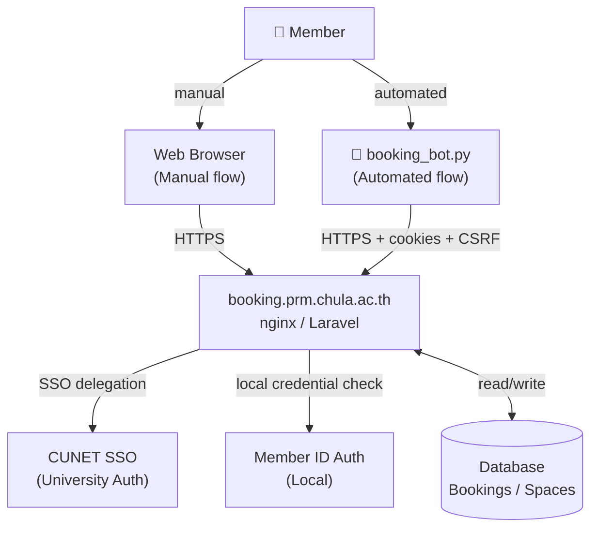
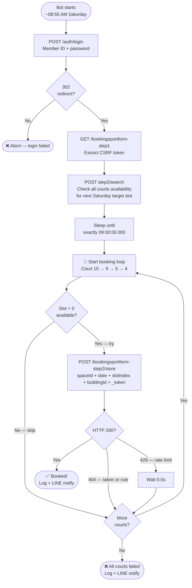
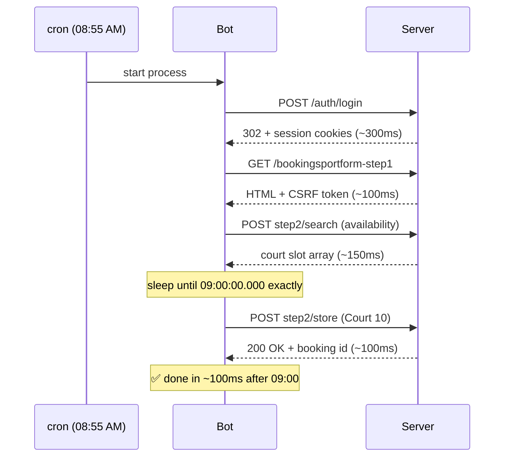

# PRM Chula Tennis Court Auto-Booking Bot

Automated booking agent for the Chulalongkorn University Physical Resource Management system at `booking.prm.chula.ac.th`. Fires every Saturday at exactly **09:00:00** — the moment the booking window opens — and reserves a tennis court for the following Saturday before any human can manually complete the process.

---

## Table of Contents

- [Background](#background)
- [System Architecture](#system-architecture)
- [API Reverse Engineering](#api-reverse-engineering)
- [Data Contracts](#data-contracts)
- [Program Logic](#program-logic)
- [Configuration Reference](#configuration-reference)
- [Setup & Deployment](#setup--deployment)
- [Known Business Rules](#known-business-rules)
- [Security Notes](#security-notes)
- [Extending the Bot](#extending-the-bot)

---

## Background

The PRM Chula booking system opens reservations **7 days in advance at exactly 09:00 AM every Saturday**. Popular courts fill within 60 seconds. This bot automates the complete booking flow — login, availability check, and reservation — with sub-second precision timing so the POST request fires at the exact moment slots become available.

### Target

| Property | Value |
|---|---|
| System | ระบบบริหารจัดการระบบกายภาพ (Physical Resource Management) |
| URL | `https://booking.prm.chula.ac.th/` |
| Server | nginx · IP `161.200.199.71:443` |
| Framework | Laravel (confirmed via session cookie names and CSRF pattern) |
| Auth | Cookie-based session + CSRF token |

---

## System Architecture



### Layer breakdown

| Layer | Components |
|---|---|
| **Client** | SPA frontend (React/Vue/Angular), login page, static assets |
| **Auth** | HTTPS/TLS, nginx reverse proxy, session cookies, CSRF tokens |
| **API** | Laravel route handlers for booking, search, user permissions |
| **Data** | Booking DB, space/court DB, session store (Redis), audit log |

---

## API Reverse Engineering

All endpoints were discovered by inspecting Chrome DevTools Network tab during a live manual booking session. The system uses **form-encoded POST requests** (not JSON) with Laravel CSRF protection.

### Endpoints

| Step | Method | Path | Purpose |
|---|---|---|---|
| 0 | `GET` | `/auth/login` | Fetch login page + CSRF token |
| 1 | `POST` | `/auth/login` | Authenticate, receive session cookies |
| 2 | `GET` | `/bookingsportform-step1` | Fetch booking page + fresh CSRF token |
| 3 | `POST` | `/bookingsportform-step1/search?page=1` | Search sport type → returns building list |
| 4 | `POST` | `/bookingsportform-step2/search?page=1` | Check slot availability for all courts |
| 5 | `POST` | `/bookingsportform-step2/store` | **Confirm booking** (the critical request) |
| 6 | `POST` | `/bookingsportforhealthlist/show` | View booking confirmation details |

### Authentication flow

```mermaid
sequenceDiagram
    participant Bot
    participant Server

    Bot->>Server: GET /auth/login
    Server-->>Bot: HTML with <input name="_token" value="CSRF_TOKEN">
    Bot->>Server: POST /auth/login (username, password, login_type=ofa, _token)
    Server-->>Bot: 302 redirect + Set-Cookie: rentalrpm_token, booking_prm_session
    Note over Bot,Server: All subsequent requests carry both cookies + CSRF headers
```



### CSRF token — 3 places required

Every state-changing request must include the CSRF token in all three locations simultaneously:

| Location | Key | Source |
|---|---|---|
| Form body | `_token` | Extracted from `<input name="_token">` in page HTML |
| Request header | `X-Csrf-Token` | Same value |
| Request header | `X-Xsrf-Token` | Same value |

Additionally, every XHR request must include `X-Requested-With: XMLHttpRequest`.

---

## Data Contracts

### Login request

```
POST /auth/login
Content-Type: application/x-www-form-urlencoded

_token=<csrf>
username=<member_id>
password=<password>
login_type=ofa
```

**Response:** `302 Found` on success. Sets two cookies:
- `rentalrpm_token` — user identity token
- `booking_prm_session` — Laravel encrypted session

---

### Step 1 search request

```
POST /bookingsportform-step1/search?page=1
Content-Type: application/x-www-form-urlencoded

sportId=2
_token=<csrf>
```

**`sportId` values:** `2` = tennis courts

**Response:** JSON with building list. Building `id=8`, name `สนามเทนนิส` is the tennis facility.

---

### Step 2 availability check request

```
POST /bookingsportform-step2/search?page=1
Content-Type: application/x-www-form-urlencoded

date=DD/MM/YYYY_BE
space[]=77&space[]=78&...&space[]=86
buildingId=8
_token=<csrf>
```

**Date format:** Thai Buddhist Era — `CE year + 543`. Example: `04/07/2569` = July 4, 2026.

**Response structure:**

```json
{
  "datas": {
    "data": {
      "86": [1, 1, 1, 1, 0, 0, 0, 0, 0, 0, 1, 1, 1, 1, 1],
      "85": [...]
    },
    "unavailableBuilding": { "isFullBuilding": false }
  }
}
```

Each key is a `spaceId`. The array has **15 integers** — one per time slot (index 0–14 = 06:00–20:00).

**Availability values:**
- `0` = **available** (can book)
- `1` = **taken** (already booked or blocked)

---

### Step 2 booking store request

```
POST /bookingsportform-step2/store
Content-Type: application/x-www-form-urlencoded

spaceId=<court_space_id>
date=DD/MM/YYYY_BE
slotIndex=<0-14>
buildingId=8
_token=<csrf>
```

**Response:** `200 OK` with JSON on success:

```json
{ "id": "<encrypted_booking_reference>" }
```

**Error response:** `404` with Thai error message (e.g. 6-hour gap rule violation).

---

## Data Contracts — Reference Tables

### Court → spaceId mapping (Building 8, Tennis)

All 10 courts are in Building `id=8` (`buildingId=8`). The spaceId is sequential:

| Court number | spaceId |
|---|---|
| 1 | 77 |
| 2 | 78 |
| 3 | 79 |
| 4 | **80** |
| 5 | **81** |
| 6 | 82 |
| 7 | 83 |
| 8 | 84 |
| 9 | **85** |
| 10 | **86** |

Bold = courts targeted by this bot (priority order: 10 → 9 → 5 → 4).

### slotIndex → time mapping

`slotIndex = desired_hour - 6` (slots start at 06:00)

| slotIndex | Time slot |
|---|---|
| 0 | 06:00–07:00 |
| 1 | 07:00–08:00 |
| **2** | **08:00–09:00** |
| 3 | 09:00–10:00 |
| 4 | 10:00–11:00 |
| 5 | 11:00–12:00 |
| 6 | 12:00–13:00 |
| 7 | 13:00–14:00 |
| 8 | 14:00–15:00 |
| 9 | 15:00–16:00 |
| 10 | 16:00–17:00 |
| 11 | 17:00–18:00 |
| 12 | 18:00–19:00 |
| 13 | 19:00–20:00 |
| 14 | 20:00–21:00 |

Slots 12–14 (18:00+) are off-peak and may carry extra charges.

---

## Program Logic

### High-level flow



### Precision timing detail



### Date calculation pseudo-logic

```
function next_saturday_be():
    today = current date
    days_ahead = (Saturday - today.weekday) mod 7
    if days_ahead == 0: days_ahead = 7        # already Saturday → next one
    next_sat = today + days_ahead
    be_year = next_sat.year + 543              # convert CE → Buddhist Era
    return format(next_sat, "DD/MM/{be_year}")
```

### CSRF extraction pseudo-logic

```
function extract_csrf(session, url):
    html = session.GET(url)
    token = html.find('<input name="_token" value="...">')
    if found: return token.value
    token = html.find('<meta name="csrf-token" content="...">')
    if found: return token.content
    token = session.cookies["XSRF-TOKEN"]
    if found: return url_decode(token)
    raise Error("CSRF token not found")
```

### Availability filter pseudo-logic

```
function is_available(slots_map, space_id, slot_index):
    slots = slots_map[space_id]        # array of 15 ints
    return slots[slot_index] == 0      # 0 = free, 1 = taken
```

---

## Configuration Reference

All configuration lives at the top of `booking_bot.py`:

| Variable | Default | Description |
|---|---|---|
| `USERNAME` | env `BOOKING_USER` | Member ID used to log in |
| `PASSWORD` | env `BOOKING_PASS` | Member password |
| `DEFAULT_HOUR` | `8` | Target booking hour (6–20) |
| `COURT_PRIORITY` | `[10, 9, 5, 4]` | Try courts in this order |
| `COURT_SPACE_MAP` | `{10:86, 9:85, 5:81, 4:80}` | Court number → internal spaceId |
| `SPORT_ID` | `2` | Sport type (2 = tennis) |
| `BUILDING_ID` | `8` | Tennis building ID |
| `LINE_TOKEN` | env `LINE_NOTIFY_TOKEN` | Optional LINE Notify token |

### Environment variables (`.env`)

```bash
BOOKING_USER=YOUR_MEMBER_ID
BOOKING_PASS=YOUR_PASSWORD
LINE_NOTIFY_TOKEN=optional_line_token
```

> **Never commit `.env` to git.** The `.gitignore` excludes it. Use `.env.example` as a template.

---

## Setup & Deployment

### Prerequisites

- Python 3.11+
- pip packages: `requests`, `beautifulsoup4`, `lxml`

### Install

```bash
pip install -r requirements.txt
# On Chula network (SSL inspection proxy):
pip install -r requirements.txt --trusted-host pypi.org --trusted-host files.pythonhosted.org
```

### First-time discovery run

Before the first Saturday, run discovery to verify the court → spaceId mapping is still correct (the system admin could reassign IDs):

```bash
python booking_bot.py --discover
```

This prints Step 1 and Step 2 API responses in full JSON. Check that spaceId 86 still maps to Court 10.

### Run the bot

```bash
# Book default slot (08:00 AM)
python booking_bot.py

# Book a specific hour
python booking_bot.py --hour 10
```

Run it **before 09:00 AM on Saturday**. The script sleeps internally until 09:00:00.000 then fires. Keep the terminal open.

### Automated deployment (VPS — recommended)

Deploy on a VPS in the **Bangkok or Singapore region** for minimum latency to `161.200.199.71`.

```bash
# crontab -e
# Fires at 08:55 AM every Saturday (gives 5 min to login before 09:00)
55 8 * * 6 cd /home/user/prm-tennis-booking && python3 booking_bot.py >> booking.log 2>&1
```

---

## Known Business Rules

These rules are enforced server-side and cannot be bypassed:

| Rule | Detail |
|---|---|
| **7-day advance booking** | Booking window opens at 09:00 AM Saturday for the following Saturday only |
| **6-hour gap rule** | A member cannot have two bookings on the same day within 6 hours of each other. Error: HTTP 404 with Thai message "ต้องเว้นอย่างน้อย 6 ชั่วโมง..." |
| **Rate limiting** | Server returns HTTP 429 if requests are too frequent. Bot waits 0.5s and moves to next court |
| **CSRF required** | Every POST needs `_token` in body + `X-Csrf-Token` + `X-Xsrf-Token` headers or request is rejected |
| **Session expiry** | `booking_prm_session` cookie is rotated on every response. The `requests.Session()` object handles this automatically |
| **Off-peak surcharge** | Slots 18:00–20:50 (slotIndex 12–14) carry additional fees — verify before booking |
| **Date format** | Date must be in `DD/MM/YYYY` format using Thai Buddhist Era (CE + 543), not CE |

---

## Security Notes

| Finding | Severity | Notes |
|---|---|---|
| `robots.txt` fully open | Info | No paths disallowed — all URLs crawlable |
| No API docs exposed | Good | `/swagger`, `/api/v1` return login redirect |
| SSL inspection proxy on Chula network | Info | Script sets `verify=False` as workaround. Use a VPS outside Chula network to avoid this |
| Member ID auth (local path) | Medium | No observable rate limiting on login. Brute-force risk if exposed |
| CSRF protection active | Good | 3-layer CSRF enforcement on all state-changing endpoints |
| Session cookie is httpOnly + secure | Good | Cannot be accessed by JavaScript |

> This bot automates **your own member account** with your own credentials. It does not bypass authentication, exploit vulnerabilities, or affect other users' bookings.

---

## Extending the Bot

### Add a new court to the priority list

1. Run `--discover` and find the `spaceId` for the new court in the Step 2 response
2. Add to `COURT_SPACE_MAP`: `{..., NEW_COURT_NUM: SPACE_ID}`
3. Add the court number to `COURT_PRIORITY` in the desired priority position

### Support a different sport

1. Run `--discover` — check Step 1 response for the sport's `BuildingId`
2. Change `SPORT_ID` to the new sport's ID
3. Change `BUILDING_ID` to the new building ID
4. Re-run `--discover` to get the new building's `space[]` range and slot count

### Book multiple slots in one run

The current bot stops after the first successful booking (one slot per run). To book multiple slots:

```python
# In run(), change the early return to a continue
if r.status_code == 200:
    log.info(f"✅ Booked Court {court}")
    booked.append(court)
    continue   # instead of return
```

Note: the 6-hour gap rule limits same-day multi-bookings. Plan slot times accordingly.

### Add email notification

Replace or extend the `notify()` function. Current implementation uses LINE Notify. To add email:

```python
import smtplib
from email.mime.text import MIMEText

def notify_email(message: str):
    msg = MIMEText(message)
    msg["Subject"] = "Tennis Booking Result"
    msg["From"] = SMTP_FROM
    msg["To"] = SMTP_TO
    with smtplib.SMTP_SSL("smtp.gmail.com", 465) as s:
        s.login(SMTP_FROM, SMTP_PASSWORD)
        s.send_message(msg)
```

### Handle session expiry mid-run

If the bot runs well before 09:00 (e.g. 08:00), the session cookie could expire before the booking fires. To handle this, re-fetch the CSRF token immediately before the booking loop (already implemented in current code — `token = extract_csrf(...)` is called after the availability check).

---

## File Structure

```
prm-tennis-booking/
├── booking_bot.py      # main bot — all logic lives here
├── requirements.txt    # pip dependencies
├── .env.example        # credential template (safe to commit)
├── .gitignore          # excludes .env, logs, __pycache__
└── README.md           # this file
```

Files **not** committed to git:
- `.env` — real credentials
- `*.log` — runtime logs
- `debug_csrf.py` — one-off debugging script
- `__pycache__/` — Python bytecode
